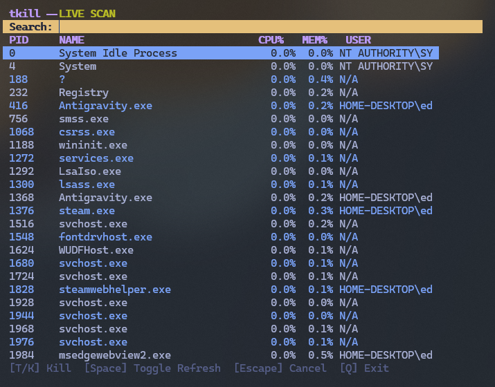

# 💀 tkill 

A high-visibility, minimalist process manager TUI for developers who need to terminate processes fast. Built with `prompt-toolkit` and `psutil`.


## ⚡ Features

- **Live Scan**: Automatically updates process list every 0.5s.
- **Instant Search**: Filter processes by PID, Name, or User in real-time.
- **Dual Performance Monitoring**: Sorts by CPU usage by default (highest first).
- **Safety Lock**: Two-tap confirmation for killing processes (__T__ then __K__).
- **Transparent Aesthetic**: High-visibility colors with terminal-native background support.
- **Cross-Platform**: Works seamlessly on Windows, macOS, and Linux.

## 🚀 Quick Start

### Installation

```bash
pip install prompt-toolkit psutil humanize
```

### Running

```bash
python tkill.py
```

## 🎮 Keybindings

| Key | Action |
| :--- | :--- |
| `↑` / `↓` | Navigate process list |
| `T` / `K` | Mark process for termination (First tap) |
| `K` | Confirm termination (Second tap) |
| `Space` | Toggle Live Scan (Pause/Resume) |
| `Esc` | Cancel selection |
| `Q` / `Ctrl+C` | Exit |

## 🛠 Building from Source

To create a standalone binary for your platform:

```bash
pip install pyinstaller
pyinstaller --onefile --name tkill tkill.py
```

## 📜 License

MIT License. Feel free to use and modify.

---
Built with ❤️ by [Your Name/Username]
